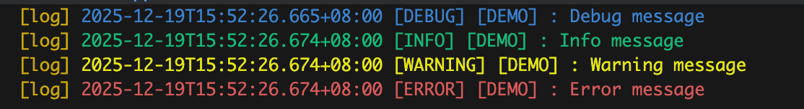

A logging utility class that supports color-coded logs in the terminal and enables writing logs to a file for persistent storage.

## Usage

```dart
import 'package:flutter_ytlog/flutter_ytlog.dart';

Log.d('DEMO', 'Debug message');
Log.i('DEMO', 'Info message');
Log.w('DEMO', 'Warning message');
Log.e('DEMO', 'Error message');
```



## Initialize configuration (optional)
```
Log.init(enable: true, writeToFile: true);
```

## Flush queued logs (optional)
When logging very frequently (especially with `writeToFile: true`), logs are queued to keep output ordering consistent. You can wait for all queued logs to finish:
```
await Log.flush();
```

## Example app
See `example/` for a runnable Flutter app that demonstrates console colors, burst logging, file output, and `flush()`.

## Get log folder
```
Directory logDir = await Log.getLogDir();
```

## Get current log file
```
File logFile = await Log.getLogFile();
```
